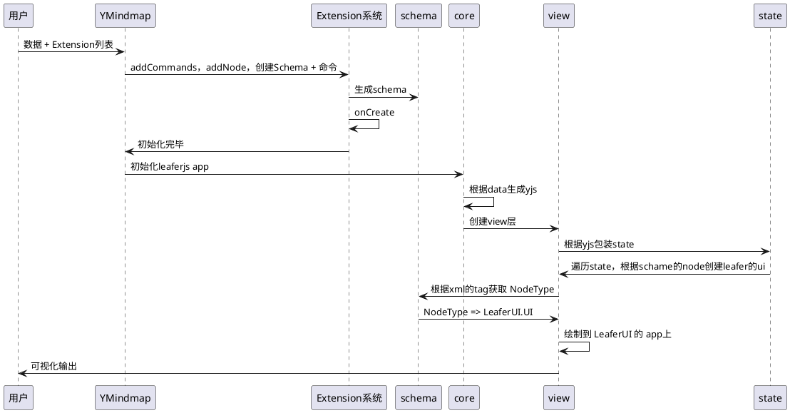

# 设计思路

## 核心模块

核心模块作为 packages 进行提供

- [@ymindmap/model](./packages/model.md) 它被用来简明的描述文档内容
- [@ymindmap/state](./packages/state.md) 对 [Yjs](https://yjs.dev/) 的一个封装，用来提供一些快捷操作数据的方式（开发中）
- [@ymindmap/view](./packages/view.md) 对 [Leafer.js](https://www.leaferjs.com/ui/) 的一个封装，同时也是 沟通视图层和数据层的一个桥梁，通过遍历 state 层将 [Yjs](https://yjs.dev/) 的 `Xml` 转为 `model` 的一个个 `Node` 和 [Leafer.js](https://www.leaferjs.com/ui/) 的显示元素
- [@ymindmap/core](./packages/core.md) 核心库，提供了 指令，插件，数据源转换等工作，对外会输出提供一个 `Board` 画板
- [@ymindmap/browser](./packages/browser.md) 对[Leafer.js](https://www.leaferjs.com/ui/)提供了在浏览器下的一些能力封装和补全，包括编辑器系统，容器封装等功能

## 核心插件

核心模块作为 extensions 进行提供

- [@ymindmap/extension-mindmap](./extensions/mindmap.md) 通过插件系统实现的思维导图的相关模型，命令，等定义

## 快速创建一个思维导图

通过引入一些核心库，即可快速创建一个思维导图，当然对应的基础封装会提供在对应的`startskit`里

```javascript
import { Mindmap, getDefaultData } from '@ymindmap/browser';
import { TextMindmapExtension } from '@ymindmap/extension-text'
import { MindmapExtension } from '@ymindmap/extension-mindmap'

const mindmap = new Mindmap({
  el: '#app',
  data: getDefaultData(),
  extensions: {
    Text: TextMindmapExtension,
    Mindmap: MindmapExtension
  },
});

mindmap.on('change', (value) => {
  localStorage.setItem('data', value)
})
```

在浏览器内使用 `YMindmap` 必须提供一个宽高尺寸不为 0 的容器

## 核心流程


