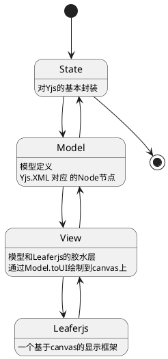
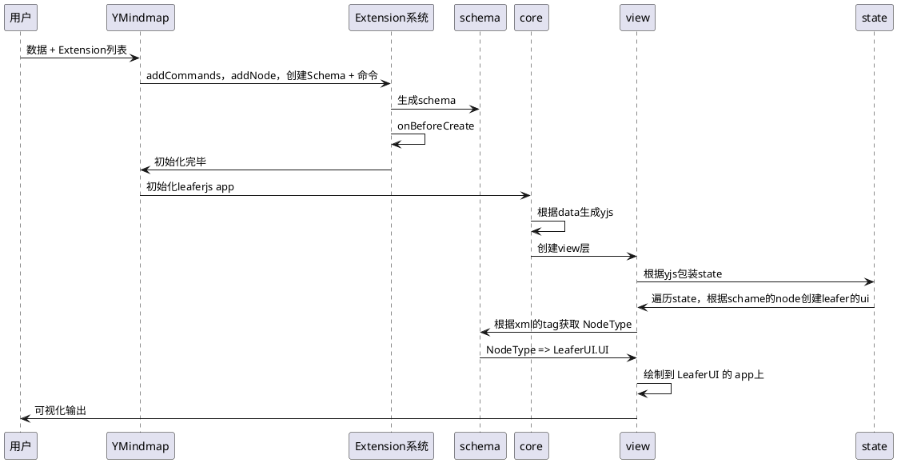
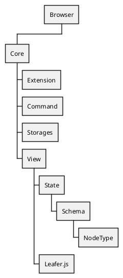

# 设计思路

整体和 `Prosemirror` 类似，尽可能的抽象成一个 `MVC` 架构出来

## 核心模块

核心模块作为 packages 进行提供

- [@ymindmap/model](./packages/model.md) 它被用来简明的描述文档内容
- [@ymindmap/state](./packages/state.md) 对 [Yjs](https://yjs.dev/) 的一个封装，用来提供一些快捷操作数据的方式（开发中）
- [@ymindmap/view](./packages/view.md) 对 [Leafer.js](https://www.leaferjs.com/ui/) 的一个封装，同时也是 沟通视图层和数据层的一个桥梁，通过遍历 state 层将 [Yjs](https://yjs.dev/) 的 `Xml` 转为 `model` 的一个个 `Node` 和 [Leafer.js](https://www.leaferjs.com/ui/) 的显示元素
- [@ymindmap/core](./packages/core.md) 核心库，提供了 指令，插件，数据源转换等工作，对外会输出提供一个 `Board` 画板
- [@ymindmap/browser](./packages/browser.md) 对[Leafer.js](https://www.leaferjs.com/ui/)提供了在浏览器下的一些能力封装和补全，包括编辑器系统，容器封装等功能

## 核心插件

核心模块作为 extensions 进行提供

因为`Ymindmap`是基于`Yjs`进行开发的，所以在设计上需要考虑到数据的同步问题，同时也要考虑到插件系统的扩展性，所以核心模块作为 extensions 进行提供。

目前主要通过以下几个插件提供了一个思维导图系统

- [@ymindmap/extension-mindmap](./extensions/mindmap.md) 通过插件系统实现的思维导图的相关模型，命令，等定义

相关核心插件会通过`startkits`暴露出的入口文件，自动进行注入

## 核心流程

## 整体架构
>
> 以在浏览器端为例，实际上`Node.js`的话，只是不用引入`Browser`罢了

