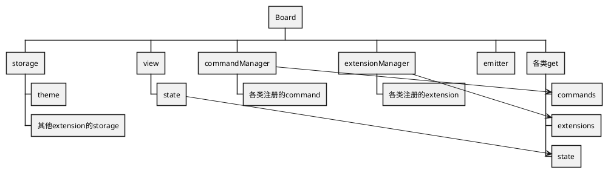

# 核心层

> 以下以 Board 画板代称

整合了`View` + `State` + `Model`

同时整个插件系统和指令系统也是核心层进行提供的

核心层整个本身也可以作为一个`EventBus`来进行使用

## 为什么要有这一层

其实这一块参考了`Tiptap`编辑器的相关实现，毕竟`Model` `State` `View` 也只是概念上的实现，真实要使用的话，还是需要整合这三者

## 整体架构

## 核心层提供了什么？

除了整合插件系统以外，还有对`view`这些模块的快捷方式

* 主题
* 插件
* 指令
* storage
* toSvg/dataUrl
* toString
* undo
* redo
* on
* emit

实际上，如果只需要在`Node.js`进行渲染，引入核心 + `Minmap`的相关`extension`就足够了

### 如何实现自己的功能

具体请参考[Extensions](../extensions/index.html)

## Todo

* [ ] 完成command系统 和 相关介绍
