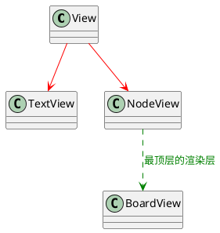

# 视图层

目前最为复杂的一层，因为`view`额外负责了真实的将生成的`ui`渲染到`Leafer.js`上

目前的View分为了好几个类型，但是期间都有继承关系

## View层做了什么?

实际上`View`可以把它理解成一个比较简单的`Dom`树
一个`View`上可以主要包含了

- **children** 子节点列表
- **parent** 父`View`
- **node** 对应`model`的`node`
- **ui** 生成出的`Leafer.js`节点的视图对象

其中，`Leafer.js`的视图对象上也会额外挂载一个 **ViewKey**(当前是 \_\_Y_MINDMAP_VIEW\_\_ )方便直接控制`Leafer.js`的元素的时候能够拿到原始的`View`对象

同时为了方便绘图，本身`view`之间也会共享一个`Context` 期间包含了当前的主题信息以及`Leafer`的`render`

### 其他一些封装的辅助变量

和`node`一样，`view` 本身会提供一些基础信息出来

- **depth** 数据层面当前`view`对应的`node`的`depth`
- **size** nodeSize
- **pos** 基于parent算出的当前`view`的位置，和prosemirror类似，相当于唯一坐标
- **bounds** 当前`view`在画布上的边界信息
- **update** 更新当前节点的绘制（开发中）

### TextView

纯文本的View类型

### NodeView

相比于TextView，NodeView会自动遍历`children`并且生成子`view`

同时额外提供一个`getMatrix`方法，用来获取在真实dom1元素上当前的尺寸和位置，类似`getBoundingClientRect`

### BoardView

对NodeView的再次封装

相比较`Nodeview`，`BoardView`内部会获得一个`state`用作数据源，同时也是整个画板

所以`BoardView`内部会初始化一个`Leafer.js`的`app`用来做绘制管理，可以理解为，`BoardView`就是一个`Leafer.js`的`app`, 其`ui`就是`Leafer.js`的`tree`, 配合着内置的`context`和`state`自动开始进行绘图

## Todo

- [ ] 基于数据变动更新view的办法
